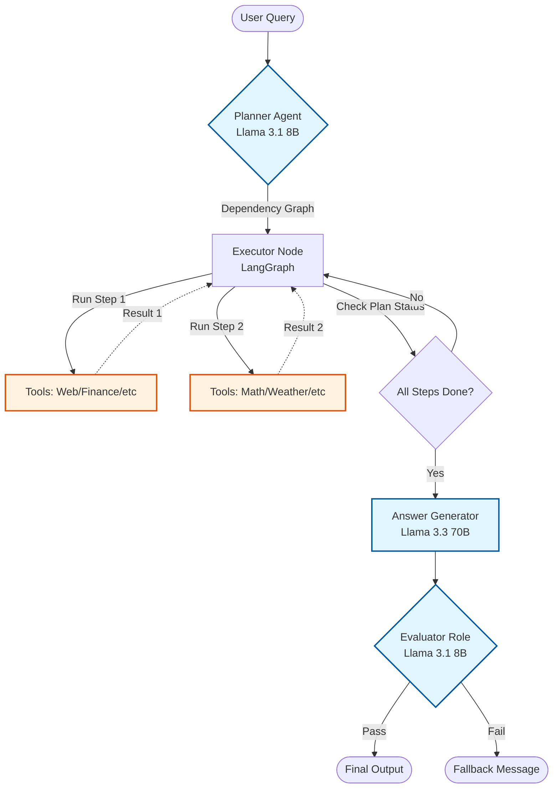

# Role-Based AI Agent System

A professional proof-of-concept demonstrating a controlled, deterministic AI agent architecture. This system uses explicit routing, specialized tools, and quality evaluation gates to ensure reliable performance.

**Note:** This is not a chatbot wrapper. This project demonstrates advanced agentic patterns suitable for enterprise applications where control and accuracy are paramount.

---

## 1. System Overview

This agent is designed to answer complex user queries that may require:
1.  **Multiple Tools**: Fetching data from independent sources simultaneously.
2.  **Sequential Logic**: Using the output of one tool as the input for another.
3.  **Strict Verification**: Ensuring answers are factually grounded before presentation.

It moves beyond simple "Router" patterns to a **"Plan-and-Execute"** architecture using a Directed Acyclic Graph (DAG).

---

## 2. Deep Dive: How Complex Queries Are Executed

The system does not just guess a tool to call. It follows a rigorous planning process. Here is a step-by-step walkthrough of how the agent handles a multi-variable query.

### Example Query
> **"Get the stock price of Apple, add 20 percent to it, and also find the current weather in Cupertino."**

### Phase 1: Planning (The Architect)
The **Planner Agent** (Llama 3.1 8B) analyzes the query and breaks it down into discrete steps with dependencies.

*   **Step 1**: `finance_tool("AAPL")`
    *   *Dependencies*: None (Run immediately)
*   **Step 2**: `weather_tool("Cupertino")`
    *   *Dependencies*: None (Run immediately)
*   **Step 3**: `math_solver("{step_1_result} * 1.20")`
    *   *Dependencies*: [Step 1] (Wait for Step 1 to complete)

### Phase 2: Execution (The Worker)
The **Executor Node** (LangGraph) receives the plan and manages the lifecycle:

1.  **Iteration 1 (Parallel Execution)**:
    *   It identifies that **Step 1** and **Step 2** have no un-met dependencies.
    *   It launches two parallel threads:
        *   Thread A calls Yahoo Finance API -> Returns `$220.50`.
        *   Thread B calls OpenMeteo API -> Returns `21°C, Sunny`.
    *   State is updated with these results. This completes steps 1 and 2.

2.  **Iteration 2 (Sequential Logic)**:
    *   It checks remaining steps. **Step 3** is now ready because Step 1 is done.
    *   **Variable Injection**: It takes the template `"{step_1_result} * 1.20"` and replaces the variable with the actual value: `"220.50 * 1.20"`.
    *   It calls the **Advanced Math Solver** with the safe expression.
    *   Math Solver returns: `264.60`.

3.  **Completion**:
    *   All steps are marked "Done". The workflow proceeds to the Solver.

### Phase 3: Synthesis (The Voice)
The **Answer Generator** (Llama 3.3 70B) receives the complete context:
> Step 1 Output: Stock Price $220.50
> Step 2 Output: Weather 21°C
> Step 3 Output: Calculated Value 264.60

It generates a human-friendly response:
> "The current stock price of Apple is $220.50. If you add 20%, the value would be $264.60. Meanwhile, the weather in Cupertino is currently 21°C and sunny."

### Phase 4: Evaluation (The Guard)
The **Evaluator Agent** reviews the final text against the original user query and the tool outputs to ensure no hallucinations occurred. If valid, the answer is returned to the user.

---

## 3. Key Features

*   **Plan-and-Execute Architecture**: Uses a Directed Acyclic Graph (DAG) approach.
*   **Dynamic Orchestration**: Powered by LangGraph, the system executes steps in parallel where possible (efficiency) and sequentially where necessary (logic).
*   **Intelligent Routing**: A specialized 8B parameter model analyzes every query to generate the execution plan, supporting variable injection between steps.
*   **Deterministic Tool Use**:
    *   **Advanced Math Solver**: Robust Python engine supporting scientific functions (trig, logs), implicit multiplication, and safe evaluation.
    *   **Web Search**: DuckDuckGo integration for real-time news and changing data.
    *   **Financial Data**: Yahoo Finance integration for real-time stock market data.
    *   **Scientific Research**: ArXiv integration for finding academic papers.
    *   **Weather**: OpenMeteo integration for real-time weather forecasts.
    *   **Wikipedia**: Dedicated grounding for conceptual questions and definitions.
*   **Quality Evaluation**: Every answer is checked by a separate "Evaluator" agent before being shown to the user.
*   **Contextual Memory**: Integrated LangChain memory allows for follow-up questions and conversational continuity.
*   **Multi-Model Architecture**: Optimized for cost and speed by using smaller models (Llama 3.1 8B) for planning/eval and larger models (Llama 3.3 70B) for complex answer generation.

---

## 4. Architecture Diagram



---

## 5. Roles and Models

| Role | Model | Functionality |
|------|-------|---------------|
| **Planner** | `llama-3.1-8b-instant` | **The Architect.** Generates a multi-step execution plan with explicit dependencies (DAG) for the executor. |
| **Executor** | *Code Logic* | **The Worker.** Iterates through the plan, resolving dependencies and executing tools in parallel where possible. |
| **Answer Generator** | `llama-3.3-70b-versatile` | **The Voice.** High-intelligence model that synthesizes tool outputs and conversation history into a clear, helpful response. |
| **Evaluator** | `llama-3.1-8b-instant` | **The Guard.** Critical quality check step that verifies if the generated answer actually addresses the user's query. |

---

## 6. Tools

1.  **Web Search (`web_search`)**
    *   *Trigger*: Queries about current events, news, or dynamic facts.
    *   *Source*: DuckDuckGo API.

2.  **Wikipedia (`wikipedia_search`)**
    *   *Trigger*: "What is...", "Who is...", conceptual explanations, and historical facts.
    *   *Source*: Wikipedia API.

3.  **ArXiv Search (`arxiv_search`)**
    *   *Trigger*: "Find research papers on...", "Latest papers about...".
    *   *Source*: ArXiv API.

4.  **Finance Tool (`finance_tool`)**
    *   *Trigger*: "Stock price of Apple", "Market cap of Nvidia".
    *   *Source*: Yahoo Finance (yfinance).

5.  **Weather Tool (`weather_tool`)**
    *   *Trigger*: "Weather in Tokyo", "Temperature in London".
    *   *Source*: OpenMeteo API.

6.  **Advanced Math Solver (`math_solver`)**
    *   *Trigger*: Explicit calculations (e.g., "sqrt(16) + log(100)", "{step_1_result} * 1.25").
    *   *Capabilities*: Arithmetic, Trigonometry, Logs, Implicit multiplication.

---

## 7. Tech Stack

*   **Framework**: [Streamlit](https://streamlit.io/) (UI)
*   **Orchestration**: Python + [LangGraph](https://python.langchain.com/docs/langgraph) (DAG Execution)
*   **LLM Provider**: [Groq](https://groq.com/) (Ultra-low latency inference)
*   **Tools**: `duckduckgo-search`, `wikipedia`, `arxiv`, `yfinance`, `openmeteo-requests`

---

## 8. Getting Started

### Prerequisites

*   Python 3.10+
*   A [Groq API Key](https://console.groq.com/)

### Installation

1.  **Clone the repository:**
    ```bash
    git clone https://github.com/your-username/agent_poc.git
    cd agent_poc
    ```

2.  **Install dependencies:**
    ```bash
    pip install -r requirements.txt
    ```

3.  **Configure Environment:**
    Create a `.env` file in the root directory:
    ```env
    GROQ_API_KEY=your_actual_api_key_here
    ```

4.  **Run the App:**
    ```bash
    python -m streamlit run streamlit_app.py
    ```

---

## 9. Project Structure

```
agent_poc/
├── streamlit_app.py        # The UI entry point
├── main_graph.py           # LangGraph orchestrator
├── planner.py              # Dependency graph generator
├── state.py                # Graph state definitions
├── answer_generator.py     # Response synthesis agent
├── evaluator.py            # Quality control agent
├── memory.py               # Conversation state management
├── config.py               # Configuration & Environment loading
├── schemas_dag.py          # Data models for DAG
└── tools/                  # Tool implementations
    ├── math_solver.py      # Advanced mathematical engine
    ├── web_search.py
    ├── wikipedia_search.py
    ├── arxiv_search.py
    ├── finance_tool.py
    └── weather_tool.py
```
